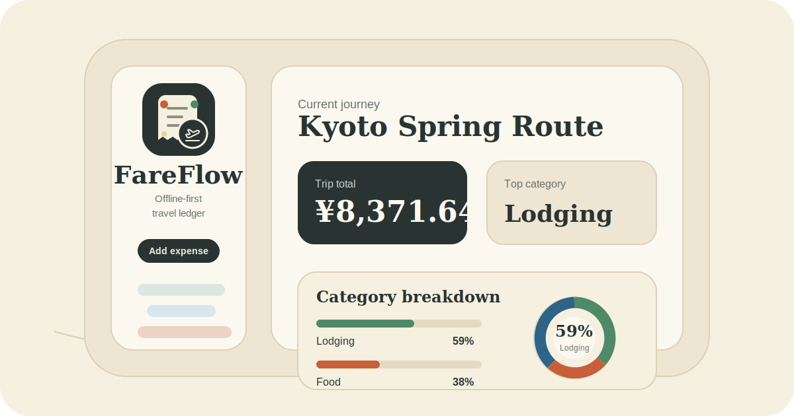

# FareFlow

<p align="center">
  
</p>

FareFlow is a mobile-first, offline-first travel expense PWA. It lets travelers capture expenses instantly, keeps an IndexedDB outbox while offline, and syncs authenticated records to Supabase when connectivity returns.

## Capabilities

- Fast trip and expense capture with local persistence before network sync.
- Multi-currency expense storage with a base-currency exchange-rate snapshot per record.
- Category breakdowns, daily trends, CSV export, and trip-level health indicators.
- Supabase magic-link authentication with RLS-backed cloud data.
- Simplified Chinese default UI with a persisted English switch.
- Installable PWA behavior through Workbox service worker generation.

## Architecture

| Area | Responsibility |
| --- | --- |
| `src/components/fareflow/` | Dashboard, drawers, analytics, recovery states, sync UI |
| `src/hooks/` | React Query hooks for trips, expenses, auth, network, and sync |
| `src/lib/domain/` | Zod schemas, money handling, analytics, defaults, seed data |
| `src/lib/offline/` | Dexie database and outbox storage |
| `src/lib/sync/` | Retry engine and Supabase remote adapter |
| `src/lib/supabase/` | Auth callbacks, clients, middleware, mappers, generated types |
| `tests/` and `e2e/` | Vitest coverage and Playwright browser flows |

Supabase is the source of truth for authenticated users. Dexie is a local cache and outbox so capture keeps working offline.

## Technology

- Next.js 16 App Router, React 19, TypeScript strict mode
- Tailwind CSS, shadcn/ui, Framer Motion, Lucide React
- TanStack Query v5 with persisted query cache
- Supabase Auth, Postgres, Storage-ready schema, and RLS
- Dexie for IndexedDB-backed local records and retry state
- `@ducanh2912/next-pwa` for Workbox generation
- Self-hosted LXGW WenKai, ZCOOL KuaiLe, Alegreya, and Comic Neue fonts
- Vercel Web Analytics

## Local Development

```bash
pnpm install
cp .env.example .env.local
pnpm dev
```

The app runs in local demo mode without Supabase credentials. Add these public variables to enable cloud authentication and sync:

```bash
NEXT_PUBLIC_SUPABASE_URL=
NEXT_PUBLIC_SUPABASE_PUBLISHABLE_KEY=
```

## Verification

```bash
pnpm verify
```

`pnpm verify` runs ESLint, TypeScript, Vitest, a production build, and Playwright. Development and production build commands explicitly use webpack because the PWA plugin configures Workbox through webpack while Next.js 16 defaults to Turbopack.

For focused checks:

```bash
pnpm lint
pnpm typecheck
pnpm test
pnpm build
pnpm test:e2e
```

## Supabase

Apply `supabase/migrations/20260512123000_initial_fareflow_schema.sql`. The migration creates:

- `trips` and `expenses`
- a private `receipts` Storage bucket
- RLS policies for authenticated ownership
- `(user_id, client_id)` uniqueness for idempotent offline retries

Supabase magic links are confirmed at `/auth/confirm`. FareFlow supports hash-session callbacks, PKCE `code` callbacks, and `token_hash` callbacks, then refreshes the shared auth cache before returning to the ledger.

## Deployment

The repository is connected to Vercel Git Integration. Pushes to `main` are verified by GitHub Actions and deployed by Vercel.

Use [docs/devops.md](docs/devops.md) for the Supabase setup, Vercel environment configuration, Cloudflare cache guidance, and release smoke checklist.

## Repository Guidance

Contributor and agent expectations live in [AGENTS.md](AGENTS.md). Product, domain, and design constraints live in [CONTEXT.md](CONTEXT.md) and [DESIGN.md](DESIGN.md).
